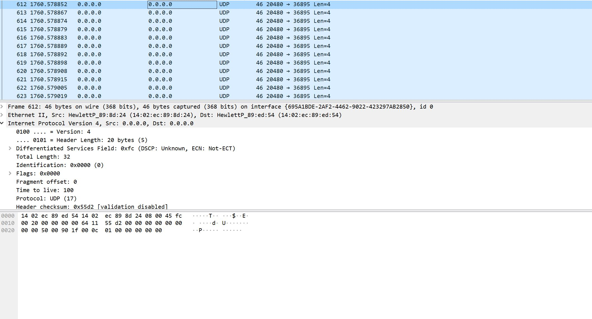

# DPDK
517021910799 朱文杰
## Part 1: Get familiar with DPDK
### Q1: What’s the purpose of using hugepage?
A1：在需要相同内存的情况下减少页表项,从而能减少TLB miss率,提升性能。
### Q2: Take examples/helloworld as an example, describe the execution flow of DPDK programs?
A2: 初始化基础运行环境 -> 失败报错 or 成功则多核运行初始化(遍历EAL指定供使用的LCORE,并且加载对应的线程) -> 运行工作函数线程 -> 等待结束
```C
int main(int argc, char **argv)
{
int ret;
unsigned lcore_id;
ret = rte_eal_init(argc, argv);
if (ret < 0)
rte_panic(“Cannot init EAL\n”);
/* call lcore_hello() on every slave lcore */
RTE_LCORE_FOREACH_SLAVE(lcore_id) {
rte_eal_remote_launch(lcore_hello, NULL, lcore_id);
}
/* call it on master lcore too */
lcore_hello(NULL);
rte_eal_mp_wait_lcore();
return 0;
}
```
### Q3: Read the codes of examples/skeleton, describe DPDK APIs related to sending and receiving packets.
在设置完成端口和队列之后,由下面两个API负责收发包,通过指定的端口和队列,以缓冲区中的数据收发指定的PKT数目。
- RTE_ETH_RX_BURST
- RTE_ETH_TX_BURST  

参数均为(端口号,队列号,缓冲区,收发包数)
### Q4: Describe the data structure of ‘rte_mbuf’
```C
   struct rte_mbuf *m = _m;
    uint32_t buf_len = mp->elt_size - sizeof(struct rte_mbuf);

    RTE_MBUF_ASSERT(mp->elt_size >= sizeof(struct rte_mbuf));

    memset(m, 0, mp->elt_size);

    /* start of buffer is just after mbuf structure */
    m->buf_addr = (char *)m + sizeof(struct rte_mbuf);
    m->buf_physaddr = rte_mempool_virt2phy(mp, m) +
            sizeof(struct rte_mbuf);
    m->buf_len = (uint16_t)buf_len;

    /* keep some headroom between start of buffer and data */
    m->pkt.data = (char*) m->buf_addr + RTE_MIN(RTE_PKTMBUF_HEADROOM, m->buf_len);

    /* init some constant fields */
    m->type = RTE_MBUF_PKT;
    m->pool = mp;
    m->pkt.nb_segs = 1;
    m->pkt.in_port = 0xff;
```
- rte_mbuf有buf_addr,buf_len,pkt,type,pool等字段
- 在结构体后紧接着分配HEADROOM
- 在HEADROOM后紧接着分配DATA
- 最后剩余的空间为TAILROOM
- buf_addr指向HEADROOM,pkt.data则指向DATA,HEAD/TAIL和DATA的总长度为buf_len
- 此外还有一些常量,比如类型,所属的mempool,端口等等。

## Part2 Send UDP
### 运行
```
make
./build/basicfwd
```
### 运行结果
最终通过虚拟机桥接端口,监听到了来自虚拟机内部的UDP包,并且UDP包可正常解析并无异常

### 障碍
- 包头格式:一开始以为全0或乱码能够通过解析,但是后来发现必须按照协议规范进行才能正确通过协议栈，并且Ether/IP/UDP不能缺少任意一者
- 大小端:例如本来上网查到的IP的协议是0X8000,结果因为大小端的问题,必须写成0X0080,还有包的大小等等
- 包大小限制:例如IP包大小小于32kb大于包头长度,UDP包大小必须小于IP的Payload必须大于UDP包头长度,因此对于大小的取值范围只有有限几个。
- 端口监听: 不管是host-only还是bridge一开始都没办法找到监听的端口,后来在虚拟机的设置中发现能指定Adapter
- Checksum: 在IP头文件中发现了checksum函数,但是UDP中没有对应的接口
### 代码实现
使用rte_pktmbuf_alloc分配mbuf,rte_pktmbuf_mtod获取到buf地址之后,分别在后面的内存处直接顺序写入三个包头以及数据并进行checksum,之后更改mbuf的长度。使用rte_eth_tx_burst发出包,并使用rte_pktmbuf_free回收
